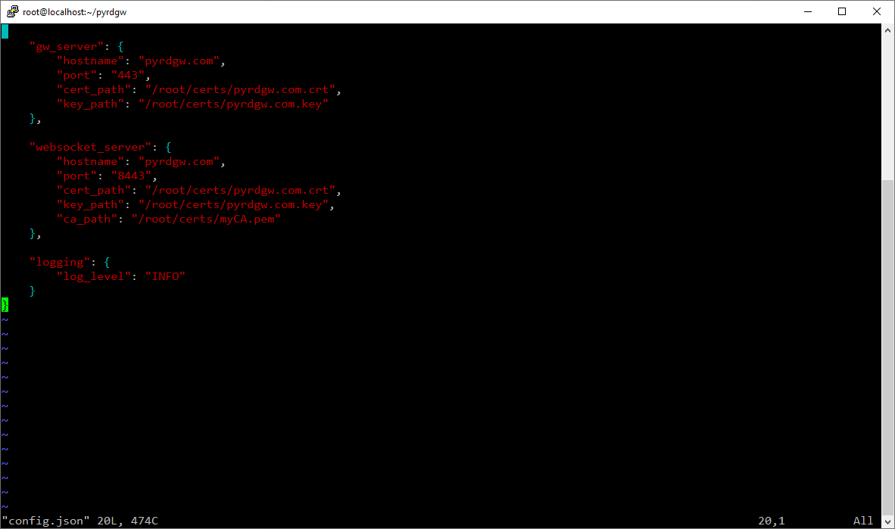
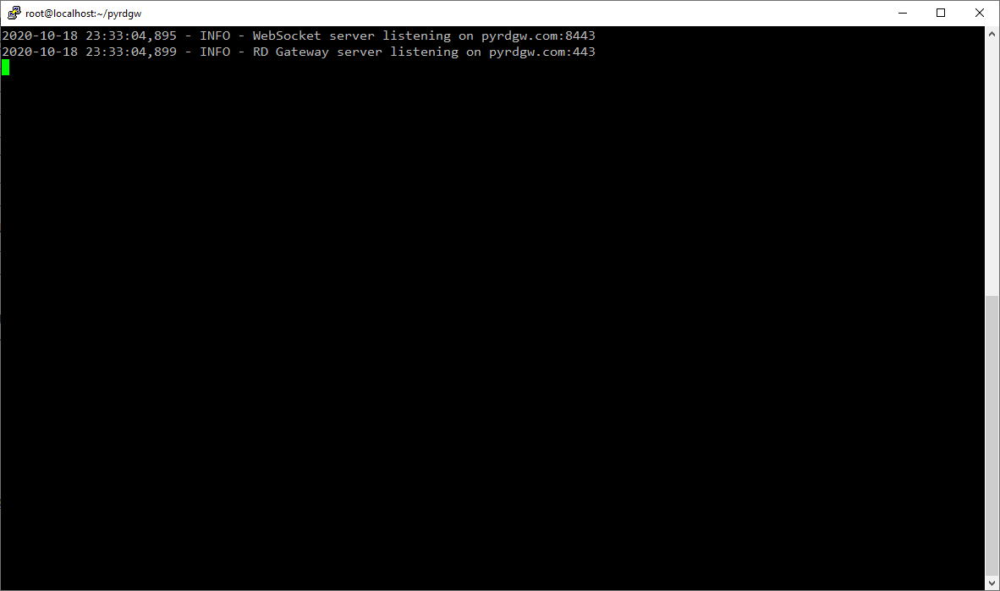
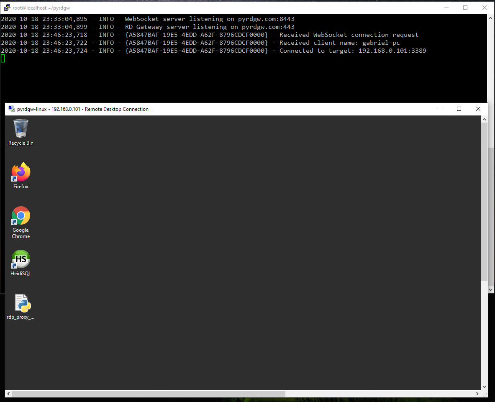

# PyRDGW
Remote Desktop Gateway protocol [[MS-TSGU]](https://docs.microsoft.com/en-us/openspecs/windows_protocols/ms-tsgu) server-side implementation in Python 3.

### What is Remote Desktop Gateway?
Remote Desktop Gateway is a Windows Remote Desktop Services feature that provides an RDP (Remote Desktop Protocol) connection over a secure HTTPS tunnel. The main use case is to allow users to connect from the internet to servers inside a private network without the need for a VPN.

### Why do we need another implementation?
I started this project while studying the protocol, mainly for educational purposes. A cross platform lightweight implementation of the protocol could potentially enable better deployment options for cloud environments, such as containers and container orchestration services, as well as provide an open source implementation that can be fully customized.

### Disclaimer
This is work in progress. The code in more or less in proof-of-concepts stage, it not production ready by no means.

### Current Limitations
- Only WebSocket transport is supported so only clients that support it should work
  - MSTSC on Windows 10 and Windows Server 2016 and above should work
  - Support for non-WebSocket HTTP transport is planned to be added
  - Support for RPC over HTTP and UDP transport is not planned
  - WebSocket query string is not supported
- The only supported authentication method is PAA
  - Clients need to provide an access token. Any token will be accepted for now, but the client need to send one
  - A hook point for custom authentication logic based on the access token is planned to be added
- No authorization
  - Everyone is authorized for everything
  - Authorization policies is planned to be added, probably using config.json

### Get it up and running
Currently, running PyRDGW will require some manual steps.
#### On the server machine:
1. Install Python dependencies: websockets and http_parser
2. Create a certificate for the RD Gateway server and the WebSocket internal server (they can use the same certificate)
3. If you are using a custom hostname in the certificate, the name should be resolvable also from within the machine running the server, to secure the communication between the GW and the WebSocket server (I might add an option to use non-TLS HTTP for this internal communication)
4. Update the hostname, ports and certificate paths in config.json:



5. Run the server: `$ python main.py`. The log is written to the console, you should see a message saying the server is listening:



#### On the client machine:
1. Import the CA certificate to the trusted CAs
2. The server hostname should be resolvable by the client, update /etc/hosts if necessary
3. Create an RDP file for the connection like the following example (since we are using PAA, it's not possible to configure the connection through the MSTSC UI, I'm not sure about other RDP clients), set the address of your target server in the "full address" field, and the RD Gateway hostname:
```
full address:s:192.168.0.101
gatewaycredentialssource:i:5
gatewayaccesstoken:s:ACCESSTOKEN123
gatewayhostname:s:pyrdgw.com
gatewayprofileusagemethod:i:1
gatewayusagemethod:i:1
server port:i:3389
```
6. Click on the RDP file to connect, the session should open and you will be promped for the logon credentials to the server, either by NLA or by the LogonUI, and you should see indication about the connection in the server log:


